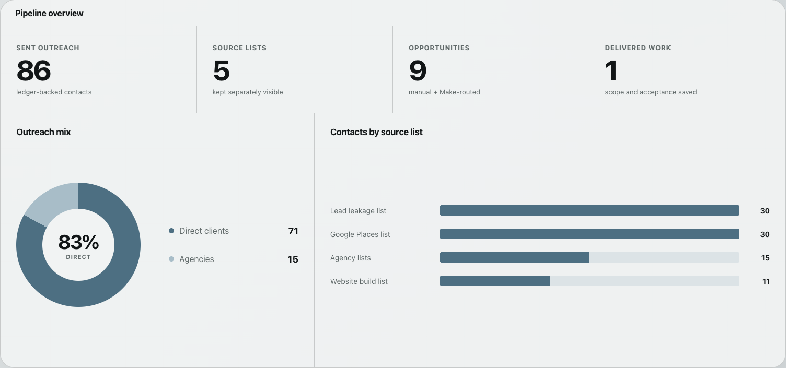
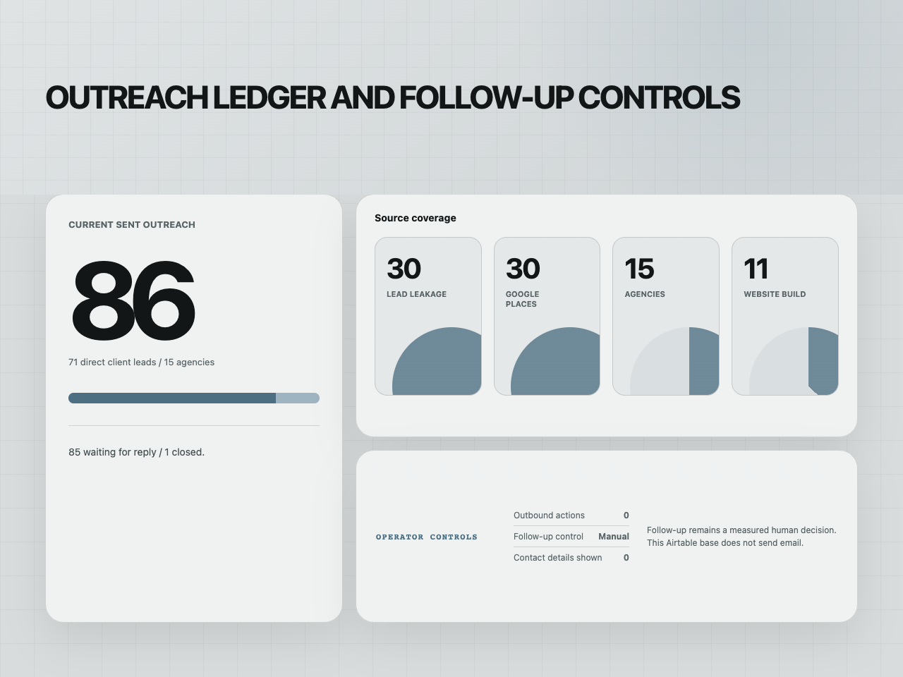
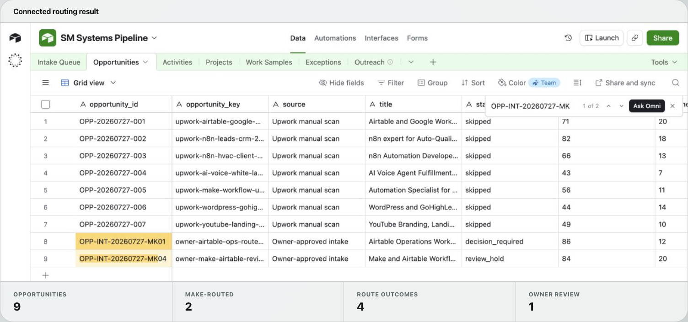
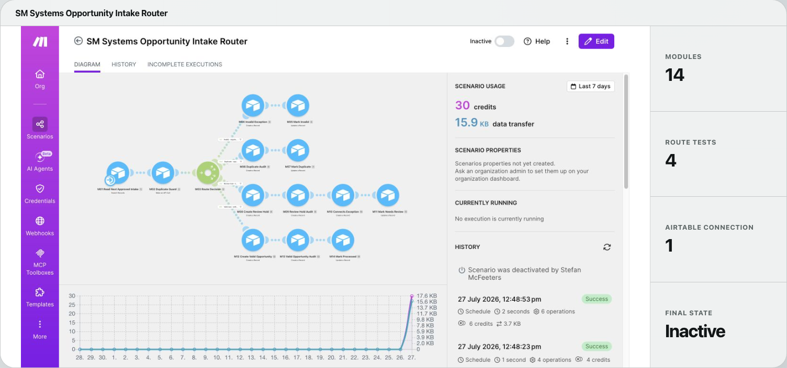
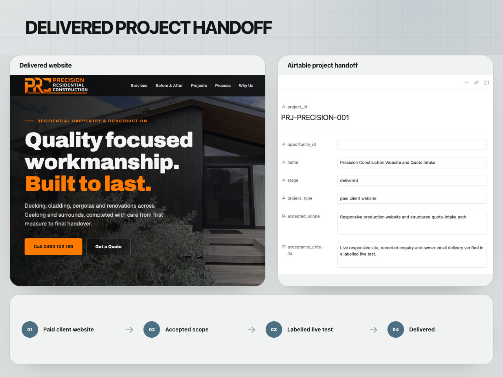

# Airtable and Make Opportunity Pipeline

An internal opportunity and delivery system for owner-approved intake, qualification, exception handling and project handoff.

The operating view lives in Airtable. Make handles bounded routing between intake states, while decisions such as follow-up, application, proposal and project acceptance remain manual.

| | |
| --- | --- |
| Status | Implemented and route-tested |
| Role | Data model, Make scenario, routing controls and delivery workflow |
| Stack | Airtable, Make, JSON contracts |
| Project page | [smsystems.au/work/airtable-make-opportunity-pipeline](https://smsystems.au/work/airtable-make-opportunity-pipeline/) |

## Operating model

```text
owner-approved intake
          │
          ▼
validate and normalise
          │
          ▼
stable-key duplicate check
          │
          ├── invalid ──────────────► exception
          ├── duplicate ────────────► existing record
          ├── review required ──────► owner decision
          └── accepted ─────────────► opportunity
                                             │
                                             ▼
                                  approved project handoff
```

The Airtable base keeps intake, opportunities, activity history, exceptions and accepted delivery scope together. Source coverage and outreach state can be reviewed without giving the automation authority to contact a prospect or submit an application.



## Outreach operations

The outreach ledger keeps source coverage, delivery state and due follow-up
visible without giving the workflow authority to send messages. The connected
view distinguishes direct-client and agency sources while keeping manual
review and external-action boundaries explicit.



Historical internal operating view, published 3 August 2026. The displayed counts describe that retained snapshot of SM Systems activity, not current pipeline totals or results achieved for a client.

## Airtable structure

The public schema under [`contracts/airtable-schema.json`](contracts/airtable-schema.json) records the system's table and field design without workspace identifiers or operating data.

| Table | Responsibility |
| --- | --- |
| Intake Queue | Immutable source reference and processing state |
| Opportunities | Qualification, decision owner and next action |
| Activities | Append-only operating history |
| Projects | Accepted scope, criteria and next milestone |
| Delivery Assets | Reusable delivery references and publication state |
| Exceptions | Invalid, conflicting or review-required records |



## Make routing

The router performs seven ordered steps: source admission, key generation, required-field checks, duplicate detection, route selection, bounded writes and terminal status.

Four route families were exercised against the connected system:

- a valid record created one opportunity and one activity;
- a retry matched the existing stable key;
- an incomplete record created an exception;
- a complete but ambiguous record stopped for owner review.

The scenario was returned to inactive after the route checks. It has no email, messaging, Upwork or proposal action.



## Delivery handoff

An opportunity becomes a project only after an explicit acceptance decision. The project record retains the agreed scope, acceptance criteria and next milestone instead of relying on messages or memory.



## Validate the public contracts

```bash
npm run validate
```

The validator checks the required tables, the seven router stages, unique example IDs and the four expected routing outcomes.

## Repository contents

```text
assets/       five presentation-ready Airtable and Make views
contracts/    provider-neutral data and routing contracts
examples/     controlled route cases and expected outcomes
scripts/      structural validator
docs/         architecture and operating boundaries
```

[Architecture and route controls](docs/architecture.md)
